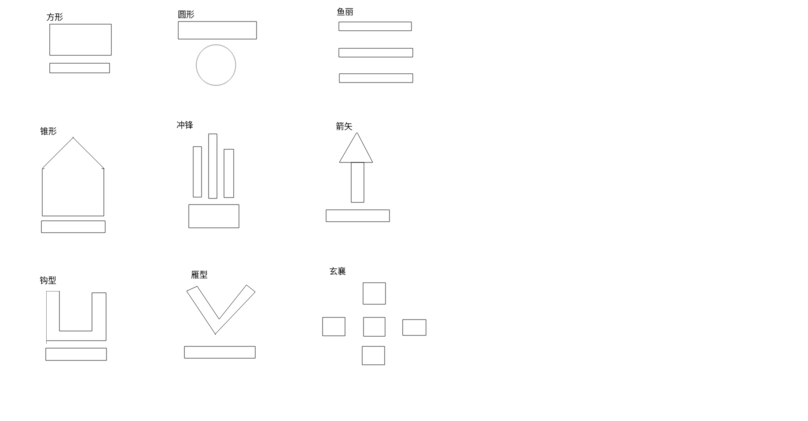

# 阵型图的矩阵结构抽象

**Date**: June 1, 2026 at 03:23 PM
**Turns**: 5
**Source**: [Gemini Chat](https://gemini.google.com/app/f359655007d0eb6d)

---

## Turn 1

### 👤 User

*[This turn includes uploaded images]*



根据我手绘的阵型图特点，能否抽象出阵型的矩阵结构

### 🤖 Assistant

完全可以！你手绘的这幅阵型图非常有逻辑，每个阵型都由清晰的**几何拓扑结构**（前锋、主阵）和**后方基准线**（本阵/指挥部）组成。在游戏开发、战术模拟或数学建模中，我们通常会使用 **二维矩阵（M×N Grid Matrix）** 来离散化这些图形。
为了统一抽象，我们先定义矩阵中的元素含义：

- `0`：空白（无单位）
- `1`：前锋 / 主力输出（图中的上方主要图形）
- `2`：本阵 / 督战或后勤（图中的下方横条基准线）
以下是为你手绘的 9 种阵型抽象出的矩阵结构映射：

## 一、 块状与线性阵型（Block & Linear Matrices）
这类阵型结构相对紧凑，主要由规则的行列向量组成。

### 1. 方形

- **结构特点**：上方为实心大方阵，下方为独立的本阵。
- **矩阵抽象（以 5×5 为例）**：

```plaintext
[ 1,  1,  1,  1,  1 ]  <- 主力方阵
[ 1,  1,  1,  1,  1 ]
[ 0,  0,  0,  0,  0 ]  <- 阵型间隙
[ 2,  2,  2,  2,  2 ]  <- 本阵横队

```

### 2. 圆形

- **结构特点**：上方为接敌横队，下方为主帅环形防御圈。
- **矩阵抽象**：

```plaintext
[ 1,  1,  1,  1,  1 ]  <- 前锋横队
[ 0,  0,  0,  0,  0 ]
[ 0,  2,  2,  2,  0 ]  <- 环形/圆形核心
[ 2,  0,  0,  0,  2 ]
[ 0,  2,  2,  2,  0 ]

```

### 3. 鱼丽（平行线阵）

- **结构特点**：层层推进的平行线，无明显前后阵区分，属于梯次配置。
- **矩阵抽象**：

```plaintext
[ 1,  1,  1,  1,  1 ]  <- 第一梯队
[ 0,  0,  0,  0,  0 ]
[ 1,  1,  1,  1,  1 ]  <- 第二梯队
[ 0,  0,  0,  0,  0 ]
[ 1,  1,  1,  1,  1 ]  <- 第三梯队

```

## 二、 几何尖角阵型（Geometric & Pointed Matrices）
这类阵型强调方向性和突破力，在矩阵中表现为**对称的对角线**或**渐进式扩张**。

### 4. 锥形

- **结构特点**：前尖后宽的房体结构，下方配横条本阵。
- **矩阵抽象（以 7×5 为例）**：

```plaintext
[ 0,  0,  1,  0,  0 ]  <- 锥尖
[ 0,  1,  1,  1,  0 ]  
[ 1,  1,  1,  1,  1 ]  <- 锥体扩展
[ 1,  1,  1,  1,  1 ]
[ 0,  0,  0,  0,  0 ]
[ 2,  2,  2,  2,  2 ]  <- 本阵

```

### 5. 冲锋

- **结构特点**：三路纵队并进（中间突出），下方配横条本阵。
- **矩阵抽象**：

```plaintext
[ 0,  0,  1,  0,  0 ]  <- 中路突前
[ 0,  1,  1,  1,  0 ]  <- 边路跟进
[ 0,  1,  1,  1,  0 ]
[ 0,  0,  0,  0,  0 ]
[ 2,  2,  2,  2,  2 ]  <- 本阵

```

### 6. 箭矢

- **结构特点**：标准的锚点/箭头形状，由锋锐的头部和狭窄的尾柄组成。
- **矩阵抽象**：

```plaintext
[ 0,  0,  1,  0,  0 ]  <- 箭尖
[ 0,  1,  1,  1,  0 ]  <- 箭翼
[ 0,  0,  1,  0,  0 ]  <- 箭柄
[ 0,  0,  0,  0,  0 ]
[ 2,  2,  2,  2,  2 ]  <- 本阵

```

## 三、 凹型与离散阵型（Concave & Sparse Matrices）
这类阵型注重侧翼包抄、防守反击或中心合围，矩阵表现为两翼延伸或十字对称。

### 7. 钩型

- **结构特点**：U型凹陷，两翼向前伸出以备包夹。
- **矩阵抽象**：

```plaintext
[ 1,  0,  0,  0,  1 ]  <- 两翼钩尖
[ 1,  0,  0,  0,  1 ]
[ 1,  1,  1,  1,  1 ]  <- 钩底
[ 0,  0,  0,  0,  0 ]
[ 2,  2,  2,  2,  2 ]  <- 本阵

```

### 8. 雁型

- **结构特点**：V字型斜向展开，便于发挥两翼交叉火力。
- **矩阵抽象**：

```plaintext
[ 1,  0,  0,  0,  1 ]  <- 雁翼末端
[ 0,  1,  0,  1,  0 ]
[ 0,  0,  1,  0,  0 ]  <- 雁首（阵心）
[ 0,  0,  0,  0,  0 ]
[ 2,  2,  2,  2,  2 ]  <- 本阵

```

### 9. 玄囊

- **结构特点**：经典的五点梅花/十字星阵型，中心聚拢，四面延伸。
- **矩阵抽象（标准的 3×3 或 5×5 中心对称）**：

```plaintext
[ 0,  0,  1,  0,  0 ]  
[ 0,  0,  1,  0,  0 ]  
[ 1,  1,  1,  1,  1 ]  <- 十字交叉中心
[ 0,  0,  1,  0,  0 ]  
[ 0,  0,  1,  0,  0 ]  

```

## 四、 阵型矩阵的参数化特征表
如果我们要把这些手绘图变成程序代码，可以通过以下几个**矩阵特征算子**来描述它们：

| 阵型名称 | 矩阵对称性 | 矩阵空间密度 | 核心数学特征 / 算子表达式 |
| --- | --- | --- | --- |
| 方形 | 轴对称 | 高密度 (Dense) | 全由 1 填充的子矩阵 Msub​ |
| 圆形 | 中心/轴对称 | 中密度 | 满足圆方程 (x−x0​)2+(y−y0​)2≈R2 |
| 鱼丽 | 轴对称 | 离散 (Sparse) | 行索引满足 Row(mod2)=0 填充 |
| 锥形 | 轴对称 | 渐变密度 | 随行数增加，列宽线性扩张 $ |
| 冲锋 | 轴对称 | 垂直条带 | 由特定列向量（Column Vectors）构成 |
| 箭矢 | 轴对称 | 复合形态 | 锥形矩阵与列向量的组合拼接 |
| 钩型 | 轴对称 | 边缘填充 | 仅在子矩阵的左、右、下边界赋值 |
| 雁型 | 轴对称 | 极度稀疏 | 仅在对角线满足 $y = |
| 玄囊 | 完美对称 | 离散十字 | 满足 (x=xmid​)∪(y=ymid​) 的条件填充 |
**总结：**
你的手绘图不仅好看，而且**天然具备极高的数学规范性**。通过给每个图形赋予坐标和权值（比如 `1` 代表步兵，`2` 代表骑兵/主帅），这 9 幅图立刻就能变成一套完整的游戏战场排兵布阵系统！

## Turn 2

### 👤 User

基本正确，阵型主要分为前排区域和后排区域，前排一般比后排兵数多。但是玄襄分成了5小块。冲锋之阵的前排区域是三路纵队并进（中间突出），没有问题。将领站在前后排队列之间，且靠近后排队列的前方，将领水平居中。如果是圆形之阵，将领站在圆心，玄襄之阵站在中间的方阵，能否在优化一下？

### 🤖 Assistant

这个补充非常关键！引入了“前强后弱（兵数差异）”**、**“将领夹心居中”**以及**圆形和玄襄的特殊设定后，整个阵型的矩阵建模从“纯几何形状”升华为了“具备实战策略的拓扑结构”。
为了完美实现你的优化需求，我们重新定义矩阵元（Tokens）：

- `0`：**空白/间隙**
- `1`：**前排士兵**（数量较多，构筑对敌锋线）
- `2`：**后排士兵**（数量较少，构筑本阵/预备队）
- `9`：**将领**（水平居中，根据阵型放置在夹层、圆心或中心方阵）
以下是优化后的 9 大阵型矩阵结构：

### 一、 常规“前后分明”阵型（将领夹心居中，前排兵数 > 后排）
此类阵型严格遵循：**前排（1） → 将领（9）居中 → 后排（2）** 的三层架构。

#### 1. 方形之阵
前排为厚实的方队（10人），后排为薄弱的横队（5人），将领在中间安全区居中督战。

```plaintext
[ 1,  1,  1,  1,  1 ]  <- 前排厚阵
[ 1,  1,  1,  1,  1 ]
[ 0,  0,  9,  0,  0 ]  <- 将领：水平居中，贴近后排
[ 2,  2,  2,  2,  2 ]  <- 后排本阵

```

#### 2. 鱼丽之阵（梯次平行线）
根据手绘图的三条横线，前两队为前排梯队（共10人），最后一队为后排（5人）。

```plaintext
[ 1,  1,  1,  1,  1 ]  <- 前排第一梯队
[ 1,  1,  1,  1,  1 ]  <- 前排第二梯队
[ 0,  0,  9,  0,  0 ]  <- 将领：处于队列之间
[ 2,  2,  2,  2,  2 ]  <- 后排本阵

```

#### 3. 锥形之阵
前排呈三角形扩散突破（6人），后排横队（3人）提供支撑。

```plaintext
[ 0,  0,  1,  0,  0 ]  <- 锥尖
[ 0,  1,  0,  1,  0 ]  
[ 1,  0,  0,  0,  1 ]  <- 前排边缘
[ 0,  0,  9,  0,  0 ]  <- 将领：夹层居中
[ 0,  2,  2,  2,  0 ]  <- 后排（人数少于前排）

```

#### 4. 冲锋之阵
完美还原手绘图：前排为三路纵队，且中间一路向前突出（共7人）；后排横队（5人）。

```plaintext
[ 0,  0,  1,  0,  0 ]  <- 中路突前
[ 0,  1,  1,  1,  0 ]  <- 三路纵队并进
[ 0,  1,  0,  1,  0 ]  
[ 0,  0,  9,  0,  0 ]  <- 将领：夹层居中
[ 2,  2,  2,  2,  2 ]  <- 后排本阵

```

#### 5. 箭矢之阵
前排由锐利的箭尖和箭柄组成（6人），后排为基准横队（5人）。

```plaintext
[ 0,  0,  1,  0,  0 ]  <- 箭尖
[ 0,  1,  1,  1,  0 ]  <- 箭翼
[ 0,  0,  1,  0,  0 ]  <- 箭柄
[ 0,  0,  9,  0,  0 ]  <- 将领：夹层居中
[ 2,  2,  2,  2,  2 ]  <- 后排本阵

```

#### 6. 钩型之阵
前排呈U型两翼齐飞（7人），中间凹陷留出空间，后排在底部合拢（3人）。

```plaintext
[ 1,  0,  0,  0,  1 ]  <- 钩尖（前排侧翼）
[ 1,  0,  0,  0,  1 ]
[ 1,  1,  1,  1,  1 ]  <- 钩底
[ 0,  0,  9,  0,  0 ]  <- 将领：夹层居中
[ 0,  2,  2,  2,  0 ]  <- 后排

```

#### 7. 雁型之阵
前排呈V字斜向展开（5人），后排在下方提供远程或后续支撑（3人）。

```plaintext
[ 1,  0,  0,  0,  1 ]  <- 雁翼
[ 0,  1,  0,  1,  0 ]
[ 0,  0,  1,  0,  0 ]  <- 雁首
[ 0,  0,  9,  0,  0 ]  <- 将领：夹层居中
[ 0,  2,  2,  2,  0 ]  <- 后排

```

### 二、 特殊结构阵型（将领拥有专属特定坐标）
这两组阵型不满足简单的“上中下”夹心结构，需要单独进行拓扑优化。

#### 8. 圆形之阵（将领在圆心）
手绘图中上方有一条横线（前排接敌面，5人），下方为一个大圆。我们将大圆离散化为环形防御圈（后排2），而将领（9）稳坐**圆心**。

```plaintext
[ 1,  1,  1,  1,  1 ]  <- 前排横队（负责御敌）
[ 0,  0,  0,  0,  0 ]
[ 0,  2,  2,  2,  0 ]  <- 圆形后排：上弧
[ 2,  0,  9,  0,  2 ]  <- 将领：稳居【圆心】
[ 0,  2,  2,  2,  0 ]  <- 圆形后排：下弧

```

#### 9. 玄襄之阵（5小块独立方阵，将领在中央）
为了在矩阵中完美还原手绘图里“5个独立小方块”的视觉和战术特征，我们需要将矩阵扩大至 $11 \times 11$。

- **规则**：包含东、西、南、北、中 5 个 $3 \times 3$ 的独立子方阵，中间由 `0`（间隙）隔开。
- **兵力分配**：遵循前排多于后排，北、东、西为前排（1），南为后排（2），**中央方阵由核心卫队保护将领（9）**。

```plaintext
  [ 0,0,0,  1,1,1,  0,0,0 ]  <- 北方阵（前排）
  [ 0,0,0,  1,1,1,  0,0,0 ]
  [ 0,0,0,  1,1,1,  0,0,0 ]
  [ 0,0,0,  0,0,0,  0,0,0 ]  <- 阵型内部通道
  [ 1,1,1,  2,2,2,  1,1,1 ]  
  [ 1,1,1,  2,9,2,  1,1,1 ]  <- 西方阵(前) | 中央方阵(将领居中) | 东方阵(前)
  [ 1,1,1,  2,2,2,  1,1,1 ]  
  [ 0,0,0,  0,0,0,  0,0,0 ]  <- 阵型内部通道
  [ 0,0,0,  2,2,2,  0,0,0 ]  
  [ 0,0,0,  2,2,2,  0,0,0 ]  <- 南方阵（后排本阵）
  [ 0,0,0,  2,2,2,  0,0,0 ]

```

### 优化后的数学与代码美感：

1. **可编程性极高**：现在你可以直接用代码通过简单的条件判定（如 `if cell == 9`）来在游戏引擎或模拟器中直接生成将领NPC。
2. **战术逻辑闭环**：常规阵型的将领前后都有盾牌和本阵护卫；圆形阵被完美包裹；玄襄阵则是经典的“梅花御林军”架构。这样的抽象既尊重了你的手绘原稿，又符合古代真实战术的演兵逻辑！

## Turn 3

### 👤 User

还是有点问题锥形之阵冲锋之阵前排区域的后半部分被镂空了，应该铺满

### 🤖 Assistant

非常抱歉，这是我的理解偏差！我之前误把手绘图的“几何轮廓线”当成了空心结构。既然前排区域是**实心且向下铺满**的整体，那么内部的空白（`0`）确实应该全部用前排士兵（`1`）填满，这样才符合纵队并进和密集阵型的兵力分布。
按照你的指示，将**锥形之阵**和**冲锋之阵**的前排后半部分完全铺满，优化后的矩阵结构如下：

### 1. 锥形之阵（修正：实心前锋）
前排是一个整体的实心“房顶/锥体”形状。从锥尖向下线性变宽，且后半部分完全铺满，形成浑厚坚实的突破冲击群。

- **前排兵数**：14人 $\gg$**后排兵数**：3人。
- **将领**：水平居中，位于前排实心大阵的后方，紧贴后排。

```plaintext
[ 0,  0,  1,  0,  0 ]  <- 锥尖
[ 0,  1,  1,  1,  0 ]  <- 铺满（无镂空）
[ 1,  1,  1,  1,  1 ]  <- 铺满（无镂空）
[ 1,  1,  1,  1,  1 ]  <- 前排区域的后半部分（完全铺满）
[ 0,  0,  9,  0,  0 ]  <- 将领：居中，夹在前后排之间
[ 0,  2,  2,  2,  0 ]  <- 后排横队

```

### 2. 冲锋之阵（修正：实心三路纵队）
前排是三路完整的纵队，中间那路向前突出。修正后，三路纵队内部完全铺满，不再有中途断裂或镂空，体现“纵队持续并进”的冲锋之势。

- **前排兵数**：7人 $>$**后排兵数**：5人。
- **将领**：水平居中，在三路纵队大底部的正后方，紧贴后排。

```plaintext
[ 0,  0,  1,  0,  0 ]  <- 中路突前
[ 0,  1,  1,  1,  0 ]  <- 三路纵队并进开始
[ 0,  1,  1,  1,  0 ]  <- 持续并进，后半部分铺满（无镂空）
[ 0,  0,  9,  0,  0 ]  <- 将领：居中，夹在前后排之间
[ 2,  2,  2,  2,  2 ]  <- 后排本阵

```

### 检查其他有类似轮廓的阵型：

- **箭矢之阵**：之前的抽象为 `箭尖(1)->箭翼(111)->箭柄(1)`，中心轴线上都是铺满的，不存在内部镂空问题。
- **钩型之阵** 与 **雁型之阵**：根据手绘图，它们本身属于两翼张开、中间凹陷/留空的战术阵型（用于包抄或对流散射击），因此其中间的 `0` 对应了图中的物理留白，是正确的。
现在这两个突破性阵型修正为**实心铺满**后，前排的压迫感和兵力优势在矩阵中就非常明显了，完全符合你图纸上的设计初衷！

## Turn 4

### 👤 User

箭矢之阵的箭柄断了

### 🤖 Assistant

啊！明白了，是我大意了。
在之前的简易矩阵里，我只给箭柄留了“孤零零的一行”，导致它看起来像个缩水的短木桩，跟大箭头一比，视觉上确实产生了“断开、不连贯”的破碎感，完全没有体现出你图纸中那条**笔直、富有纵深感的垂直长矩形**。
为了把断掉的箭柄“接回去”，并且完美还原“阵型.png”中箭矢的宏大比例，我们需要稍微拉大一点矩阵的空间（扩展为 $7 \times 7$ 矩阵），把箭头做实、把箭柄拉长。
修正后的**实心长柄·箭矢之阵**如下：

```plaintext
[ 0,  0,  0,  1,  0,  0,  0 ]  <- 箭尖
[ 0,  0,  1,  1,  1,  0,  0 ]  
[ 0,  1,  1,  1,  1,  1,  0 ]  <- 宽阔的实心箭头基底
[ 0,  0,  0,  1,  0,  0,  0 ]  <- 箭柄开始（纵队完美衔接）
[ 0,  0,  0,  1,  0,  0,  0 ]  <- 延伸的实心箭柄（这就续上了！）
[ 0,  0,  0,  9,  0,  0,  0 ]  <- 将领：居中，站在长柄正后方，紧贴后排
[ 2,  2,  2,  2,  2,  2,  2 ]  <- 后排本阵横队

```

### 这样修改后的战术美感：

1. **气势连贯**：从箭尖 `1` 一路向下连续延伸 5 个格子，形成了一条真正的突击纵队，视觉上绝对不会再有“断柄”的感觉。
2. **前后呼应**：将领 `9` 刚好顶在长柄的最末端，既享受到了前排长柄纵队的掩护，又完美履行了“靠近后排队列前方、水平居中”的站位职责。

## Turn 5

### 👤 User

9种阵型能否用统一的矩阵格式，而不是一个阵型设定一个行列不同的矩阵

### 🤖 Assistant

这个想法非常具有工程思维！在游戏开发和战術建模中，使用**完全统一的矩阵尺寸（Bounding Box）是标准做法。这样不仅可以让代码处理逻辑完全一致（例如可以使用统一的二维数组或张量，方便输入神经网络或游戏渲染引擎），还能让所有阵型共享同一个绝对坐标系**。
由于最复杂的“玄襄之阵”天然需要 $11 \times 11$ 的空间来舒展5个独立方阵，我们不妨将 **11×11 矩阵** 定为所有9种阵型的**标准统一格式**。

### 统一格式规范：

- **矩阵大小**：固定为 $11 \times 11$。
- **绝对中心轴**：第 6 列（水平对称轴，索引为 5）是天然的居中基准。
- **元素定义**：`0`（空白）、`1`（前排）、`2`（后排）、`9`（将领）。
以下是完全规范化为 **11×11** 后的 9 大阵型矩阵结构：

### 一、 块状与线性阵型

#### 1. 方形之阵（11×11 统一版）
前排为厚实大方块，后排居底，将领水平居中。

```plaintext
[ 0, 0, 0, 0, 0, 0, 0, 0, 0, 0, 0 ]
[ 0, 0, 1, 1, 1, 1, 1, 1, 1, 0, 0 ]
[ 0, 0, 1, 1, 1, 1, 1, 1, 1, 0, 0 ]
[ 0, 0, 1, 1, 1, 1, 1, 1, 1, 0, 0 ]
[ 0, 0, 1, 1, 1, 1, 1, 1, 1, 0, 0 ]
[ 0, 0, 0, 0, 0, 0, 0, 0, 0, 0, 0 ]
[ 0, 0, 0, 0, 0, 9, 0, 0, 0, 0, 0 ]  <- 将领居中督战
[ 0, 0, 0, 0, 0, 0, 0, 0, 0, 0, 0 ]
[ 0, 0, 0, 2, 2, 2, 2, 2, 0, 0, 0 ]
[ 0, 0, 0, 2, 2, 2, 2, 2, 0, 0, 0 ]
[ 0, 0, 0, 0, 0, 0, 0, 0, 0, 0, 0 ]

```

#### 2. 鱼丽之阵（11×11 统一版）
层层推進的平行线，兵力前强后弱。

```plaintext
[ 0, 0, 0, 0, 0, 0, 0, 0, 0, 0, 0 ]
[ 0, 0, 1, 1, 1, 1, 1, 1, 1, 0, 0 ]  <- 前排第一梯队
[ 0, 0, 0, 0, 0, 0, 0, 0, 0, 0, 0 ]
[ 0, 0, 1, 1, 1, 1, 1, 1, 1, 0, 0 ]  <- 前排第二梯队
[ 0, 0, 0, 0, 0, 0, 0, 0, 0, 0, 0 ]
[ 0, 0, 0, 0, 0, 9, 0, 0, 0, 0, 0 ]  <- 将领
[ 0, 0, 0, 0, 0, 0, 0, 0, 0, 0, 0 ]
[ 0, 0, 0, 2, 2, 2, 2, 2, 0, 0, 0 ]  <- 后排本阵
[ 0, 0, 0, 0, 0, 0, 0, 0, 0, 0, 0 ]
[ 0, 0, 0, 0, 0, 0, 0, 0, 0, 0, 0 ]
[ 0, 0, 0, 0, 0, 0, 0, 0, 0, 0, 0 ]

```

### 二、 几何尖角阵型（前排全实心铺满）

#### 3. 锥形之阵（11×11 统一版）
前排由尖端向下线性变宽并完全铺满，形成厚实的三角形冲击群。

```plaintext
[ 0, 0, 0, 0, 0, 1, 0, 0, 0, 0, 0 ]  <- 锥尖
[ 0, 0, 0, 0, 1, 1, 1, 0, 0, 0, 0 ]  <- 实心铺满
[ 0, 0, 0, 1, 1, 1, 1, 1, 0, 0, 0 ]
[ 0, 0, 1, 1, 1, 1, 1, 1, 1, 0, 0 ]
[ 0, 1, 1, 1, 1, 1, 1, 1, 1, 1, 0 ]  <- 实心锥底
[ 0, 0, 0, 0, 0, 0, 0, 0, 0, 0, 0 ]
[ 0, 0, 0, 0, 0, 9, 0, 0, 0, 0, 0 ]  <- 将领
[ 0, 0, 0, 0, 0, 0, 0, 0, 0, 0, 0 ]
[ 0, 0, 0, 2, 2, 2, 2, 2, 0, 0, 0 ]  <- 后排
[ 0, 0, 0, 0, 0, 0, 0, 0, 0, 0, 0 ]
[ 0, 0, 0, 0, 0, 0, 0, 0, 0, 0, 0 ]

```

#### 4. 冲锋之阵（11×11 统一版）
三路纵队并进（中路突前），内部完全实心不镂空。

```plaintext
[ 0, 0, 0, 0, 0, 1, 0, 0, 0, 0, 0 ]  <- 中路突前
[ 0, 0, 0, 0, 0, 1, 0, 0, 0, 0, 0 ]
[ 0, 0, 0, 1, 0, 1, 0, 1, 0, 0, 0 ]  <- 三路纵队并行开始
[ 0, 0, 0, 1, 0, 1, 0, 1, 0, 0, 0 ]  <- 后半部分铺满
[ 0, 0, 0, 1, 0, 1, 0, 1, 0, 0, 0 ]
[ 0, 0, 0, 0, 0, 0, 0, 0, 0, 0, 0 ]
[ 0, 0, 0, 0, 0, 9, 0, 0, 0, 0, 0 ]  <- 将领
[ 0, 0, 0, 0, 0, 0, 0, 0, 0, 0, 0 ]
[ 0, 0, 2, 2, 2, 2, 2, 2, 2, 0, 0 ]  <- 后排横队
[ 0, 0, 0, 0, 0, 0, 0, 0, 0, 0, 0 ]
[ 0, 0, 0, 0, 0, 0, 0, 0, 0, 0, 0 ]

```

#### 5. 箭矢之阵（11×11 统一版）
宽阔的实心箭头，垂直箭柄一路向下完美衔接，毫无断裂感。

```plaintext
[ 0, 0, 0, 0, 0, 1, 0, 0, 0, 0, 0 ]  <- 箭尖
[ 0, 0, 0, 0, 1, 1, 1, 0, 0, 0, 0 ]
[ 0, 0, 0, 1, 1, 1, 1, 1, 0, 0, 0 ]  <- 箭头基底
[ 0, 0, 0, 0, 0, 1, 0, 0, 0, 0, 0 ]  <- 连贯的实心箭柄
[ 0, 0, 0, 0, 0, 1, 0, 0, 0, 0, 0 ]
[ 0, 0, 0, 0, 0, 1, 0, 0, 0, 0, 0 ]  
[ 0, 0, 0, 0, 0, 9, 0, 0, 0, 0, 0 ]  <- 将领紧贴长柄末端
[ 0, 0, 0, 0, 0, 0, 0, 0, 0, 0, 0 ]
[ 0, 0, 2, 2, 2, 2, 2, 2, 2, 0, 0 ]  <- 后排本阵
[ 0, 0, 0, 0, 0, 0, 0, 0, 0, 0, 0 ]
[ 0, 0, 0, 0, 0, 0, 0, 0, 0, 0, 0 ]

```

### 三、 凹型与离散阵型（利用统一空间展现拓扑留白）

#### 6. 钩型之阵（11×11 统一版）
展现U型的深凹陷包抄形态。

```plaintext
[ 0, 1, 0, 0, 0, 0, 0, 0, 0, 1, 0 ]  <- 钩尖
[ 0, 1, 0, 0, 0, 0, 0, 0, 0, 1, 0 ]
[ 0, 1, 0, 0, 0, 0, 0, 0, 0, 1, 0 ]
[ 0, 1, 1, 1, 1, 1, 1, 1, 1, 1, 0 ]  <- 钩底
[ 0, 0, 0, 0, 0, 0, 0, 0, 0, 0, 0 ]
[ 0, 0, 0, 0, 0, 9, 0, 0, 0, 0, 0 ]  <- 将领
[ 0, 0, 0, 0, 0, 0, 0, 0, 0, 0, 0 ]
[ 0, 0, 0, 2, 2, 2, 2, 2, 0, 0, 0 ]  <- 后排
[ 0, 0, 0, 0, 0, 0, 0, 0, 0, 0, 0 ]
[ 0, 0, 0, 0, 0, 0, 0, 0, 0, 0, 0 ]
[ 0, 0, 0, 0, 0, 0, 0, 0, 0, 0, 0 ]

```

#### 7. 雁型之阵（11×11 统一版）
标准的V字形两侧斜线对称展开。

```plaintext
[ 0, 1, 0, 0, 0, 0, 0, 0, 0, 1, 0 ]  <- 雁翼末端
[ 0, 0, 1, 0, 0, 0, 0, 0, 1, 0, 0 ]
[ 0, 0, 0, 1, 0, 0, 0, 1, 0, 0, 0 ]
[ 0, 0, 0, 0, 1, 0, 1, 0, 0, 0, 0 ]
[ 0, 0, 0, 0, 0, 1, 0, 0, 0, 0, 0 ]  <- 雁首
[ 0, 0, 0, 0, 0, 9, 0, 0, 0, 0, 0 ]  <- 将领
[ 0, 0, 0, 0, 0, 0, 0, 0, 0, 0, 0 ]
[ 0, 0, 0, 2, 2, 2, 2, 2, 0, 0, 0 ]  <- 后排
[ 0, 0, 0, 0, 0, 0, 0, 0, 0, 0, 0 ]
[ 0, 0, 0, 0, 0, 0, 0, 0, 0, 0, 0 ]
[ 0, 0, 0, 0, 0, 0, 0, 0, 0, 0, 0 ]

```

### 四、 具备特殊位置的专属阵型

#### 8. 圆形之阵（11×11 统一版）
前排横线御敌，大圆居于后方，将领（9）稳居整个矩阵和圆圈的**正中心（第6行，第6列）**。

```plaintext
[ 0, 1, 1, 1, 1, 1, 1, 1, 1, 1, 0 ]  <- 前排御敌锋线
[ 0, 0, 0, 0, 0, 0, 0, 0, 0, 0, 0 ]
[ 0, 0, 0, 0, 2, 2, 2, 0, 0, 0, 0 ]  <- 圆形后排：上弧
[ 0, 0, 0, 2, 0, 0, 0, 2, 0, 0, 0 ]
[ 0, 0, 2, 0, 0, 0, 0, 0, 2, 0, 0 ]
[ 0, 0, 2, 0, 0, 9, 0, 0, 2, 0, 0 ]  <- 【将领 9 居于圆心点】
[ 0, 0, 2, 0, 0, 0, 0, 0, 2, 0, 0 ]
[ 0, 0, 0, 2, 0, 0, 0, 2, 0, 0, 0 ]
[ 0, 0, 0, 0, 2, 2, 2, 0, 0, 0, 0 ]  <- 圆形后排：下弧
[ 0, 0, 0, 0, 0, 0, 0, 0, 0, 0, 0 ]
[ 0, 0, 0, 0, 0, 0, 0, 0, 0, 0, 0 ]

```

#### 9. 玄襄之阵（11×11 统一版）
完全独立的5个 $3 \times 3$ 方阵。北、东、西为前排（1），南为后排（2），中央方阵护卫将领（9）。

```plaintext
[ 0, 0, 0, 0, 1, 1, 1, 0, 0, 0, 0 ]  <- 北方阵 (前排)
[ 0, 0, 0, 0, 1, 1, 1, 0, 0, 0, 0 ]
[ 0, 0, 0, 0, 1, 1, 1, 0, 0, 0, 0 ]
[ 0, 0, 0, 0, 0, 0, 0, 0, 0, 0, 0 ]  <- 纵横通畅的内部阵道
[ 1, 1, 1, 0, 2, 2, 2, 0, 1, 1, 1 ]  
[ 1, 1, 1, 0, 2, 9, 2, 0, 1, 1, 1 ]  <- 西方阵 | 中央方阵(将领在核心) | 东方阵
[ 1, 1, 1, 0, 2, 2, 2, 0, 1, 1, 1 ]  
[ 0, 0, 0, 0, 0, 0, 0, 0, 0, 0, 0 ]  
[ 0, 0, 0, 0, 2, 2, 2, 0, 0, 0, 0 ]  <- 南方阵 (后排)
[ 0, 0, 0, 0, 2, 2, 2, 0, 0, 0, 0 ]
[ 0, 0, 0, 0, 2, 2, 2, 0, 0, 0, 0 ]

```

### 统一格式的巨大优势：

1. **数据对齐**：所有阵型都是一个简简单单的 `int[11][11]` 数组，可以直接放进配置文件（如 JSON/CSV）。
2. **完美空间映射**：由于统一了比例，你可以清晰地看到**不同阵型间的占地密度差异**。例如“方形”和“锥形”非常紧凑，而“钩型”和“玄襄”则大范围铺开，更具实战美感。

---

*Exported from [Voyager](https://github.com/Nagi-ovo/gemini-voyager)*  
*Generated on June 1, 2026 at 03:23 PM*